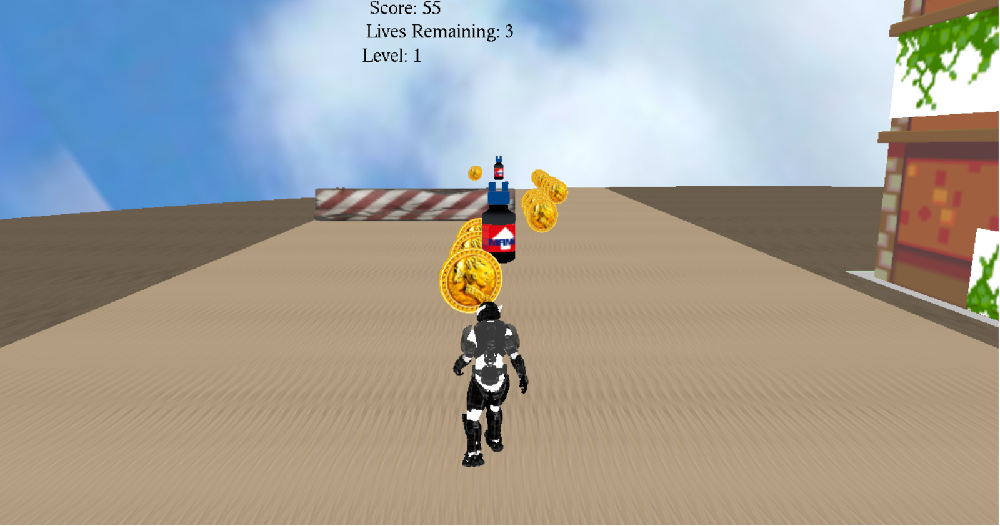
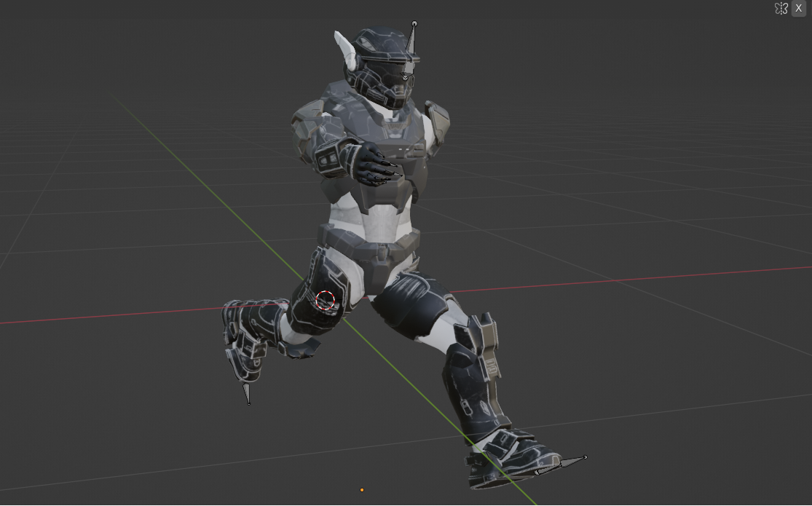

## C-Avoid
is a simple 3d game made with C++ language and glut(OpenGL) Library. The game has two levels and one player character that is running to collect coins to increase his score, drinks to increase his trials and trying to avoid the obstacles.
The game contains many features like sound effects, first and third camera view and light effects.

## Game View:

## Player theme:

